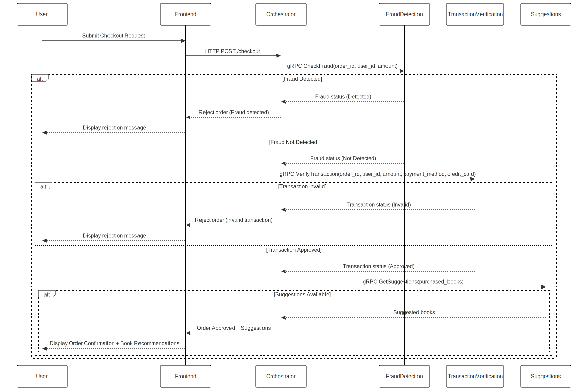

# Documentation

This folder should contain your documentation, explaining the structure and content of your project. It should also contain your diagrams, explaining the architecture. The recommended writing format is Markdown.

# Online Bookstore - Fraud Detection & Orchestrator Update

## 📌 Overview

This repository contains the **Online Bookstore Checkout System**, which includes a **REST API-based Orchestrator** and multiple **gRPC-based microservices**. This update focuses on **fixing fraud detection**, ensuring that fraudulent orders are correctly rejected, and adding two new services: **Transaction Verification** and **Book Suggestions**.

---

## 🚀 What's New in This Update?

### **1️⃣ Added Two New Microservices**

- `` → Ensures orders are valid (checks for missing fields, invalid payments, etc.).
- `` → Provides book recommendations based on user purchases.

### **2️⃣ Fixed Fraud Detection Integration**

- The **orchestrator now correctly calls the fraud detection service** instead of using a test service (`HelloServiceStub`).
- **Fraud detection service now processes real order data** and flags transactions above **\$1000** as fraudulent.
- **Implemented multi-threading** in the orchestrator for better efficiency.

### **3️⃣ Updated **``** API in Orchestrator**

- Calls `check_fraud()` and `check_transaction()` before approving orders.
- Calls `get_suggestions()` to fetch book recommendations.
- **Rejects fraudulent or invalid transactions instead of always approving them.**
- Runs services in **separate threads** for better performance.

### **4️⃣ Refactored **``** Files and Regenerated gRPC Stubs**

- Added `transaction_verification.proto` and `suggestions.proto` in `utils/pb/`.
- Regenerated gRPC stubs using:
  ```bash
  python -m grpc_tools.protoc -I=utils/pb --python_out=utils/pb --grpc_python_out=utils/pb utils/pb/transaction_verification/transaction_verification.proto
  python -m grpc_tools.protoc -I=utils/pb --python_out=utils/pb --grpc_python_out=utils/pb utils/pb/suggestions/suggestions.proto
  ```

---

## 📦 How to Run the Project

### **1️⃣ Build & Start Services**

Run the following command to build and start all containers:

```bash
docker compose up --build
```

### **2️⃣ Verify Running Services**

Check if the fraud detection, transaction verification, and suggestions services are running correctly:

```bash
docker logs $(docker ps -q --filter "name=fraud_detection")
docker logs $(docker ps -q --filter "name=transaction_verification")
docker logs $(docker ps -q --filter "name=suggestions")
```

### **3️⃣ Test Each Service Individually**

#### **Fraud Detection Service**

```bash
grpcurl -plaintext -d '{"order_id": "99999", "user_id": "user999", "amount": 1500}' localhost:50051 fraud_detection.FraudService/CheckFraud
```

✅ Expected Output:

```json
{
    "is_fraud": true
}
```

#### **Transaction Verification Service**

```bash
grpcurl -plaintext -d '{"order_id": "12345", "user_id": "user1", "amount": 500, "payment_method": "credit_card"}' localhost:50052 transaction_verification.TransactionVerificationService/VerifyTransaction
```

✅ Expected Output:

```json
{
    "is_valid": true,
    "reason": "Transaction is valid."
}
```

#### **Book Suggestions Service**

```bash
grpcurl -plaintext -d '{"purchased_books": ["Book A"]}' localhost:50053 suggestions.SuggestionsService/GetSuggestions
```

✅ Expected Output:

```json
{
    "suggested_books": ["Book C", "Book D"]
}
```

---

## 📂 Project Structure

```
📦 ds-practice-2025
 ┣ 📂 fraud_detection
 ┃ ┣ 📂 src
 ┃ ┃ ┗ 📜 app.py  # Fraud detection microservice
 ┃ ┣ 📜 Dockerfile
 ┃ ┗ 📜 requirements.txt
 ┣ 📂 transaction_verification
 ┃ ┣ 📂 src
 ┃ ┃ ┗ 📜 app.py  # Transaction verification microservice
 ┃ ┣ 📜 Dockerfile
 ┃ ┗ 📜 requirements.txt
 ┣ 📂 suggestions
 ┃ ┣ 📂 src
 ┃ ┃ ┗ 📜 app.py  # Book suggestions microservice
 ┃ ┣ 📜 Dockerfile
 ┃ ┗ 📜 requirements.txt
 ┣ 📂 orchestrator
 ┃ ┣ 📂 src
 ┃ ┃ ┗ 📜 app.py  # Orchestrator REST API
 ┃ ┣ 📜 Dockerfile
 ┃ ┗ 📜 requirements.txt
 ┣ 📂 utils
 ┃ ┣ 📂 pb
 ┃ ┃ ┣ 📂 fraud_detection
 ┃ ┃ ┣ 📂 transaction_verification
 ┃ ┃ ┣ 📂 suggestions
 ┃ ┃ ┃ ┣ 📜 .proto files for gRPC
 ┃ ┃ ┃ ┣ 📜 generated .py files
 ┗ 📜 docker-compose.yaml
```

---
## 📂 Architechural and System Design Diagrams
### Architecture diagram


### System design Flow

## ❗ Important Notes

- Ensure that all `.proto` files are properly compiled using `grpc_tools.protoc`.
- If you face `ModuleNotFoundError`, delete old `.proto` Python files and regenerate them.
- If **Docker is not working properly**, rebuild everything:
  ```bash
  docker compose down
  docker compose build --no-cache
  docker compose up
  ```

---

## 👥 Contributors

- **Swagata** - Fixed fraud detection integration, added transaction verification & suggestions microservices.
- **Team Members** - Review & additional feature development.

🚀 **Now the fraud detection, transaction verification, and book suggestions services work together!** Let’s ensure everything functions properly before merging. 🔥

